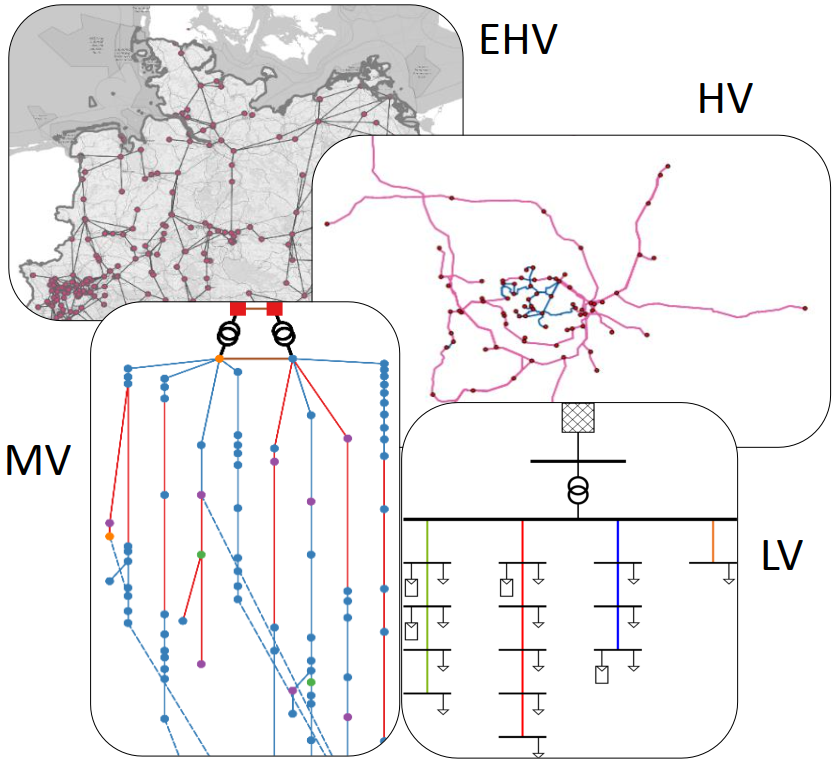

#############################
SimBench Grids
#############################

SimBench provides an dataset of electrical power system benchmark models with grid data from low voltage level to extra high voltage level with full year load, generation and storage profiles.

The grids are received using the following function:

.. autofunction:: simbench.get_simbench_net
